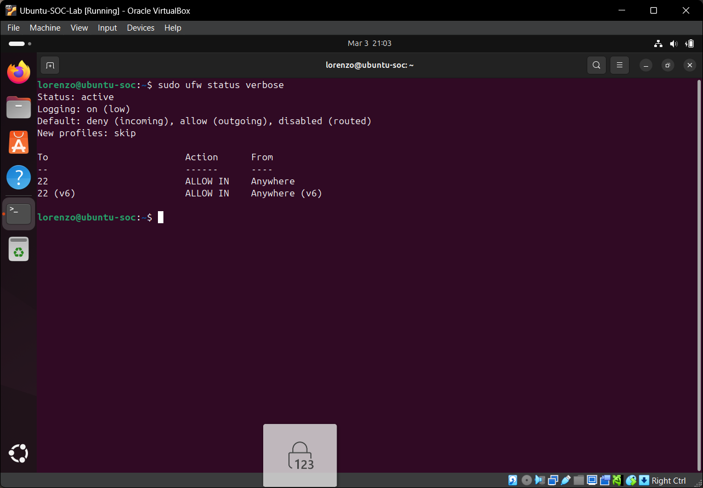
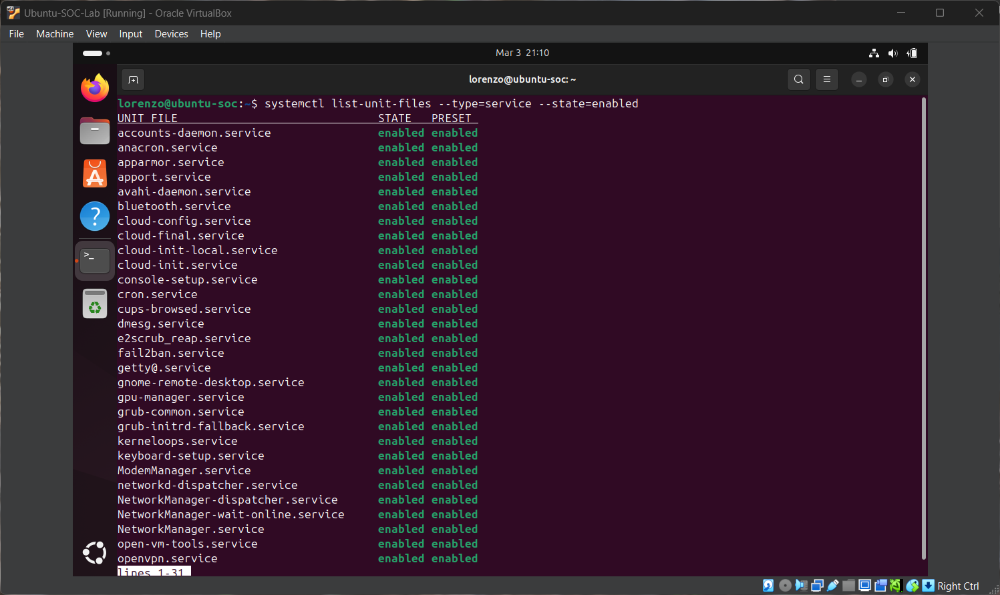
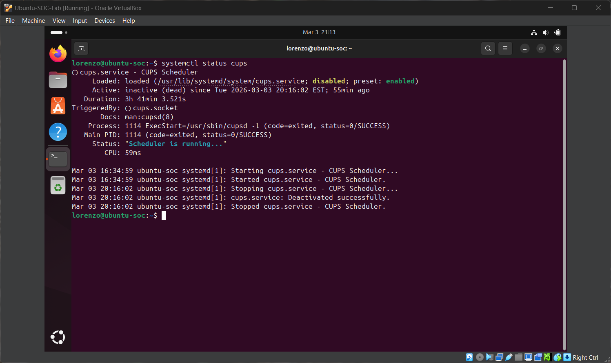
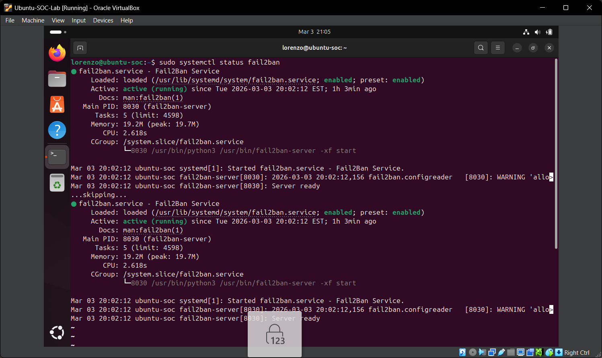
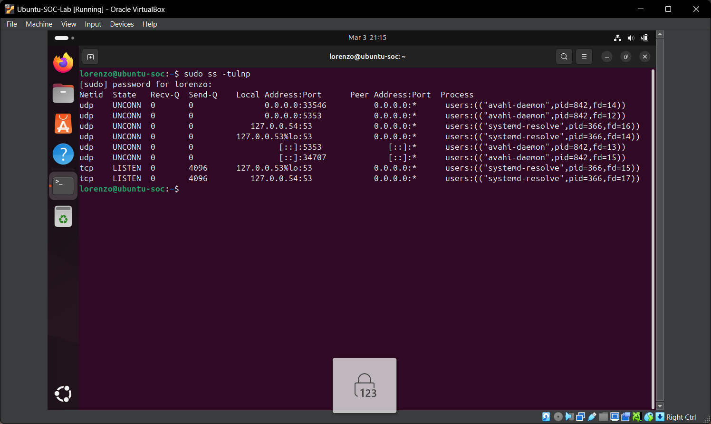

# Linux System Hardening Lab

This project demonstrates Linux system hardening techniques performed on an Ubuntu virtual machine. The lab focuses on reducing the attack surface by configuring firewall rules, auditing running services, disabling unnecessary services, implementing brute-force protection, and reviewing open network ports.

## Lab Environment

Hypervisor: VirtualBox  
Operating System: Ubuntu  
Host RAM: 16GB  

## Security Tools Used

- UFW (Uncomplicated Firewall)
- Fail2Ban
- systemctl
- ss (socket statistics)

---

## Firewall Configuration

Configured UFW to block incoming connections by default.

Commands used:

```bash
sudo ufw default deny incoming
sudo ufw default allow outgoing
sudo ufw enable
sudo ufw status verbose
```



---

## Service Auditing

Checked enabled services to identify unnecessary services that could increase the attack surface.

```bash
systemctl list-unit-files --type=service --state=enabled
```



---

## Disabled Unnecessary Services

Disabled the CUPS printing service since it was not required for the system.

```bash
systemctl status cups
```



---

## Brute Force Protection

Installed and enabled Fail2Ban to protect against SSH brute-force attacks.

```bash
sudo apt install fail2ban -y
sudo systemctl enable fail2ban
sudo systemctl start fail2ban
sudo systemctl status fail2ban
```



---

## Open Port Audit

Audited open network ports to verify that only necessary services were listening.

```bash
sudo ss -tulnp
```



---

## Security Concepts Demonstrated

- Attack surface reduction
- Firewall configuration
- Service auditing
- Brute-force attack mitigation
- Linux system hardening

## Future Improvements

• SSH hardening  
• Log monitoring  
• Intrusion detection integration  
• SIEM integration
